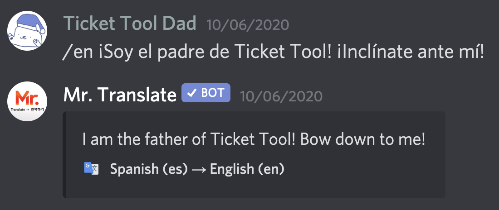

# How to Translate

Get started translating messages easily by using `/` and the language code you want to translate to, or by reacting to a message with a supported flag.

## Using Commands to Translate

The default prefix is `/`. Use the prefix and the language code you want to translate to followed by the text you want translated like so:

### Using Flag Reactions to Translate

If you want to translate a message without having to copy and paste it, react to it with a flag. The bot will react with the same flag if it is supported to prevent translating to the same language multiple times. 

